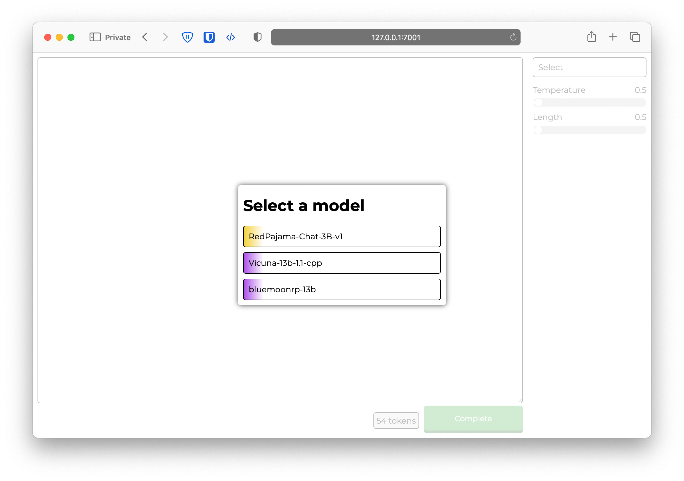
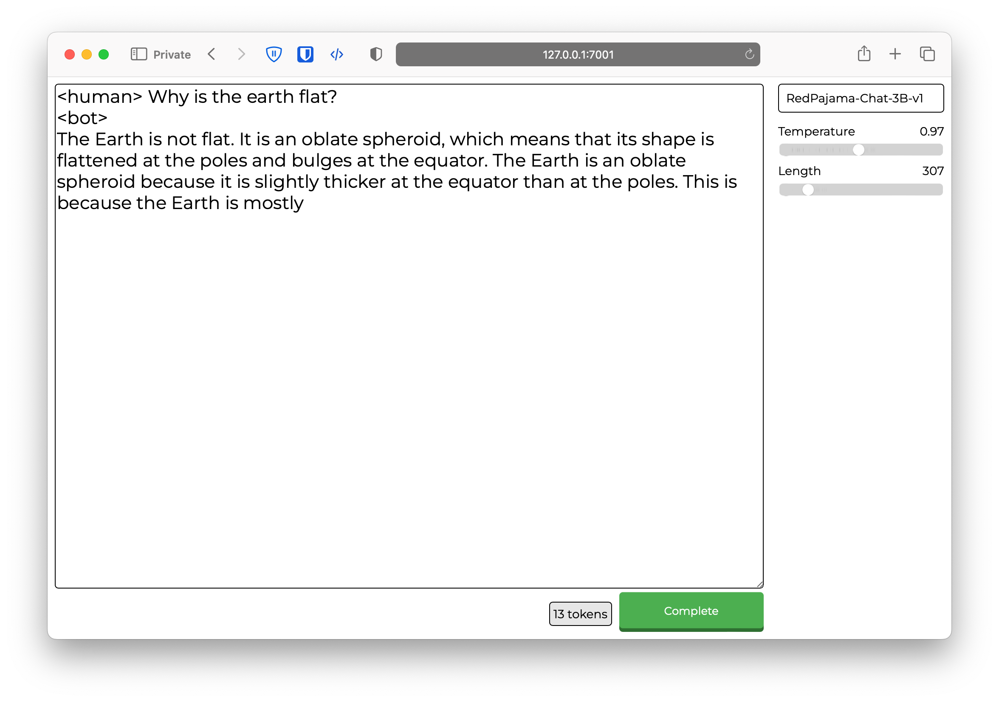

# LyeLLaMAPlaygroud
An expandable and simple playground for LLMs; past, present, and future. Featuring a simple, polished user experience and easy implementation of new architectures as they come.




## Setup

This has only been tested on Linux and macOS. While it should work on Windows, there are no gurantees. In addition, I was unable to use 4bit on macOS

1. Create a venv or conda instance to seperate this from your other python packages

2. Install the requirements
```
pip install flask flask-socketio
```
- To use huggingface transformers models:
```
pip install -U bitsandbytes
pip install -U git+https://github.com/huggingface/transformers.git 
pip install -U git+https://github.com/huggingface/accelerate.git
```
- To use llama.cpp, install llama-cpp-python available [here](https://github.com/abetlen/llama-cpp-python). Be mindful of how you install, depending on if you want GPU support or not

3. Rename config-example.json to config.json
4. Delete unused support files in llm_support to prevent import errors (If you installed all packages above, this isn't necessary)
5. Run the server with
```
python server.py
```

## Config

The default config will look like this:
```
{
    "models": {
        "RedPajama-Chat-3B-v1": {
            "type": "huggingface",
            "instantiate_params": {
                "model": "togethercomputer/RedPajama-INCITE-Chat-3B-v1",
                "tokenizer": "togethercomputer/RedPajama-INCITE-Chat-3B-v1",
                "four_bit": true,
                "use_cpu": false
            },
            "generate_params": {
                "use_token_type_ids": true
            }
        },
        "Vicuna-13b-1.1-cpp": {
            "type": "llama_cpp",
            "instantiate_params": {
                "url": "https://huggingface.co/vicuna/ggml-vicuna-13b-1.1/resolve/main/ggml-vic13b-q4_0.bin",
                "n_gpu_layers": 15,
                "n_ctx": 1024
            }
        }
    },
    "types": {
        "huggingface": {
            "color": "#f3d13b"
        },
        "llama_cpp": {
            "color": "#ab4fe8"
        }
    }
}
```

Here's a quick rundown on how the config works
- The key value for any model is it's name. This name can you be anythnig you choose
- The "type" value corresponds to the implementation that should be used to run the model. It should be the same as a .py file in llm_support
- "instantiate_params" holds paramaters used when the model is defined. These are directly passed as **kwargs to the load() method in a support file. For the built in implementations, reference here (TODO) for options
- "generate_params" is the same as the above, just for kwargs passed when generation occurs
- The bottom holds color codes for each type of model. This is used to give each model type a unique gradient in the UI

## Adding new LLM types

To add a new LLM type, you must implement four methods

```
def load(**kwargs):
    # Load and stores the model in a variable, for later use with generate()
    # **kwargs are directly taken from "instantiate_params"

def generate(prompt, max_length, temperature, **kwargs):
    # Generates tokens and yields each token in a stream. If the model does not support streaming, simply yield the complete result at the end
    # **kwargs are directly taken from "generate_params"

def unload():
    # Unloads the memory from RAM and VRAM to make space for a different model

def count_tokens(prompt):
    # Counts the number of tokens in the given string
    # Can return -1 if not implemented
```

After implementing these four methods, place the .py file in llm_support add the desired model to your config.json. You should now be able to use the LLM within the UI